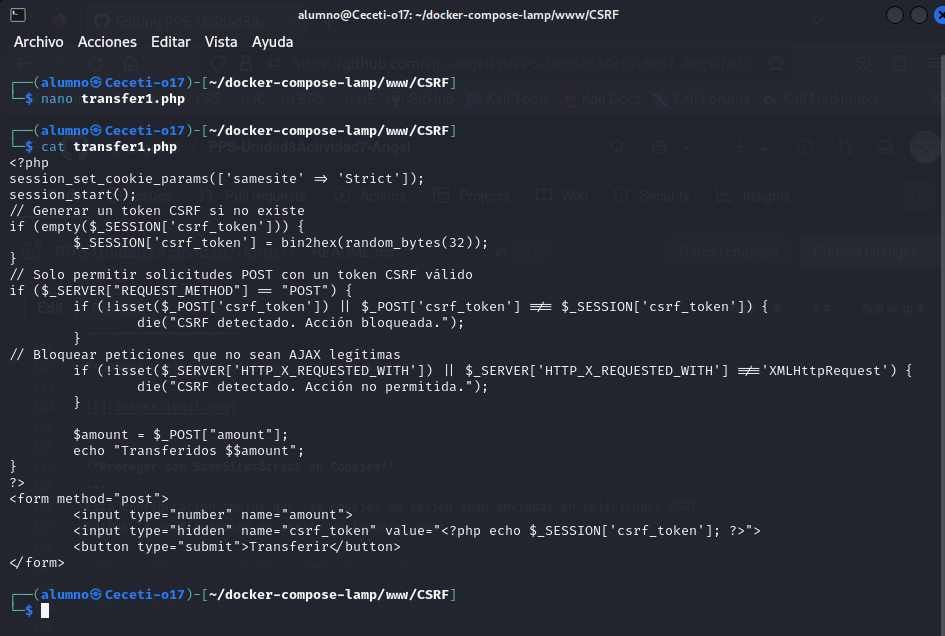

# PPS-Unidad3Actividad7-Angel
Explotación y Mitigación de Cross-Site Request Forgery (CSRF).

Objetivos:

- Comprobar las maneras en las que se puede realizar ataques Cross-Site Request Forgery (CSRF)

- Analizar el código de la aplicación que permite ataques de Cross-Site Scripting (CSRF)

- Implementar diferentes modificaciones del codigo para aplicar mitigaciones o soluciones.

---

## ¿Qué es CSRF?
El Cross-Site Request Forgery (CSRF) es un ataque donde un atacante engaña a un usuario autenticado (por ejemplo, alguien que está conectado a su cuenta bancaria online) para que haga algo no deseado en un sitio web sin su consentimiento.

En resumen, el atacante puede forzar al usuario a realizar una acción sin que se dé cuenta, usando su sesión activa. Por ejemplo, el atacante podría hacer que el usuario transfiera dinero sin saberlo.

Ejemplo:
Un usuario está conectado a su banco online. El atacante le envía un enlace malicioso. Cuando el usuario hace clic, el enlace hace una transferencia sin que él lo sepa.

## ACTIVIDADES A REALIZAR

* Leer detenidamente la sección de [Inyección CSRF de la página de PortWigger](https://portswigger.net/web-security/csrf)

* Leer el siguiente [documento sobre Explotación y Mitigación de ataques de Inyección CSRF](./files/ExplotacionYMitigacionCSRF.pdf) de Raúl Fuentes. Nos va a seguir de guía para aprender a explotar y mitigar ataques de inyección Cross-Site Request Forgery (CSRF)>
 
* También y como marco de referencia, tienes [ la sección de correspondiente de ataque XSS reglejado de la **Proyecto Web Security Testing Guide** (WSTG) del proyecto **OWASP**.]<https://owasp.org/www-project-web-security-testing-guide/stable/4-Web_Application_Security_Testing/06-Session_Management_Testing/05-Testing_for_Cross_Site_Request_Forgery>

---

## Código vulnerable

Crear el archivo vulnerable: transfer1.php. Este archivo php está ubicado en la entidad bancaria online y nos permite realizar una transferencia.
~~~
<?php
if ($_SERVER["REQUEST_METHOD"] == "POST") {
$amount = $_POST["amount"];
echo "Transferidos $$amount";
}
?>
<form method="post">
<input type="number" name="amount">
<button type="submit">Transferir</button>
</form>
~~~

Como observamos en la siguiente captura, el código no comprueba si la solicitud viene de un lugar seguro, por lo que puede ser aprovechado por un atacante para realizar una transferencia sin que el usuario lo sepa.

### Explotación de CSRF
---
El atacante crea un archivo HTML malicioso (csrf_attack.html), que contiene un código como este:

~~~
<!DOCTYPE html>
<html>
<body>
	
</body>
</html>
~~~

Este archivo no está ubicado en la web del banco sino que está ubicada en una web del atacante o alguna utilizada por él. 
Fíjate que el enlace a este archivo http puede haberse hecho llegar a través de cualquier medio: email, o haber sido falsificada.

Cuando el usuario autenticado accede a esta página:

- La imagen no se carga realmente.

- El navegador ejecuta la petición a transfer.php automáticamente.

- Se transfiere dinero sin que el usuario lo sepa.

Revisamos el log de apache para confirmar el ataque. Normalmente está en /var/log/apache2/access.log, como nosotros lo tenemos en un contenedor docker, lo buscamos allí, bien en access.log o en other_vhosts_access.log.

~~~
docker exec lamp-php83 /bin/bash -c "tail -5 /var/log/apache2/other_vhosts_access.log"
~~~

Como observamos en la captura anterior, el ataque CSRF se ejecutó correctamente.

- El log indica que el navegador envió una solicitud GET a transfer.php?amount=1000 desde
csrf_attack.html.
- El servidor respondió con 200 OK, lo que significa que la transacción se realizó sin que el usuario lo
notara.

Esto significa que transfer.php es vulnerable a CSRF porque no verifica el origen de la solicitud ni usa
protección con tokens.

Una variante es que podemos insertar un formulario automático en una página legítima, con una estética muy parecida al diseño original, para engañar a la víctima.

Crea el archivo csrf_attack2.html:
~~~
<!DOCTYPE<html>
<body>
        <form action="http://localhost/transfer.php" method="POST">
                <input type="hidden" name="amount" value="1000">
                <input type="submit">
        </form>
        
</body>
</html>
~~~

A continuación, el usuario realiza una transferencia, pero no se da cuenta que en realidad ha realizado una transferencia a la cuenta del atacante.

El ataque CSRF automático funcionó
- El log indica que el navegador envió una solicitud POST a transfer.php desde csrf_attack2.html.
- El servidor respondió con 200 OK, lo que significa que la transacción se ejecutó sin que el usuario lo
notara.

Esto significa que transfer.php sigue siendo vulnerable a CSRF en solicitudes automáticas porque no está
validando un token CSRF en la petición POST.

### Mitigaciones
---
**Verificando que transfer.php está protegiendo correctamente con el token CSRF**
---

- Modificamos el archivo transfer.php:

- Nos aseguramos de que el código tiene esta validación:

~~~
<?php
session_start();
// Generar un token CSRF si no existe
if (empty($_SESSION['csrf_token'])) {
        $_SESSION['csrf_token'] = bin2hex(random_bytes(32));
}
// Solo permitir solicitudes POST con un token CSRF válido
if ($_SERVER["REQUEST_METHOD"] == "POST") {
        if (!isset($_POST['csrf_token']) || $_POST['csrf_token'] !== $_SESSION['csrf_token']) {die("CSRF detectado. Acción bloqueada.");
        }
        $amount = $_POST["amount"];
        echo "Transferidos $$amount";
}
?>
<form method="post">
        <input type="number" name="amount">
        <input type="hidden" name="csrf_token" value="<?php echo $_SESSION['csrf_token']; ?>">
        <button type="submit">Transferir</button>
</form>
~~~

Con esta validación, transfer.php rechazará cualquier petición POST sin un token CSRF válido.

Probamos a ejecutar de nuevo csrf_attack2.html:

**Bloqueando Solicitudes CSRF con Encabezados HTTP**
---
Además del token CSRF, podemos bloquear peticiones automáticas exigiendo el encabezado X-Requested-With.

Modificar transfer.php para agregar esta verificación:

~~~
session_start();
// Generar un token CSRF si no existe
if (empty($_SESSION['csrf_token'])) {
        $_SESSION['csrf_token'] = bin2hex(random_bytes(32));
}
// Solo permitir solicitudes POST con un token CSRF válido
if ($_SERVER["REQUEST_METHOD"] == "POST") {
        if (!isset($_POST['csrf_token']) || $_POST['csrf_token'] !== $_SESSION['csrf_token']) {
                die("CSRF detectado. Acción bloqueada.");
        }
// Bloquear peticiones que no sean AJAX legítimas
        if (!isset($_SERVER['HTTP_X_REQUESTED_WITH']) || $_SERVER['HTTP_X_REQUESTED_WITH'] !=='XMLHttpRequest') {
                die("CSRF detectado. Acción no permitida.");
        }

        $amount = $_POST["amount"];
        echo "Transferidos $$amount";
}
?>
<form method="post">
        <input type="number" name="amount">
        <input type="hidden" name="csrf_token" value="<?php echo $_SESSION['csrf_token']; ?>">
        <button type="submit">Transferir</button>
</form>
~~~

Probamos a ejecutar de nuevo csrf_attack2.html:

**Proteger con SameSite=Strict en Cookies**
---
Esta configuración impide que las cookies de sesión sean enviadas en solicitudes CSRF.
Editar la configuración de sesión en transfer.php:

`session_set_cookie_params(['samesite' => 'Strict']);`

`session_start();`

Esto evitará que un atacante pueda robar la sesión en peticiones automáticas.

Probamos a ejecutar de nuevo csrf_attack2.html:

**Probamos con todas la mitigaciones**
---
Aplicamos todas las mitigaciones:
~~~
<?php
// Configurar la cookie de sesión para bloquear ataques CSRF
session_set_cookie_params([
        'samesite' => 'Strict', // Bloquea solicitudes desde otros sitios
        'httponly' => true, // Bloquea acceso a la cookie desde JavaScript
        'secure' => false // Cambiar a true si usas HTTPS
]);
session_start();
// Generar un token CSRF si no existe
if (empty($_SESSION['csrf_token'])) {
        $_SESSION['csrf_token'] = bin2hex(random_bytes(32));
}
// Solo permitir solicitudes POST
if ($_SERVER["REQUEST_METHOD"] !== "POST") {
        die("Error: Método no permitido");
}
// 1️ - Validar que el token CSRF está presente y es correcto
if (!isset($_POST['csrf_token']) || $_POST['csrf_token'] !== $_SESSION['csrf_token']){
        die("CSRF detectado. Acción bloqueada.");
}
// 2️ - Validar que la solicitud proviene del mismo origen
if (!isset($_SERVER['HTTP_REFERER']) || parse_url($_SERVER['HTTP_REFERER'],PHP_URL_HOST) !== $_SERVER['HTTP_HOST']) {
        die("CSRF detectado: Referer inválido.");
}
// 3️ - Bloquear peticiones que no sean AJAX
if (!isset($_SERVER['HTTP_X_REQUESTED_WITH']) || $_SERVER['HTTP_X_REQUESTED_WITH'] !=='XMLHttpRequest') {
        die("CSRF detectado: No es una solicitud AJAX válida.");
}
// Si todas las validaciones pasan, procesar la transferencia
$amount = $_POST["amount"];
echo "Transferidos $$amount";
?>
<form method="post">
        <input type="number" name="amount">
        <input type="hidden" name="csrf_token" value="<?php echo $_SESSION['csrf_token'];
?>">
<button type="submit">Transferir</button>
</form>
~~~

Explicación de las correcciones:

- Bloquea todas las solicitudes GET (ya no se puede usar  para ataques CSRF).

- Verifica que el csrf_token coincida con el de la sesión.

- Verifica que la solicitud provenga del mismo dominio (HTTP_REFERER).

- Exige que las solicitudes sean AJAX (X-Requested-With: XMLHttpRequest).

> Si la mitigación está funcionando, la solicitud POST debería ser rechazada y deberías ver un mensaje como "CSRF detectado. Acción bloqueada." en la pantalla.
> Para hacer uso ahora de transfer.php tendríamos que hacer una petición más compleja, no es suficiente con introducir la ruta en el navegador.

